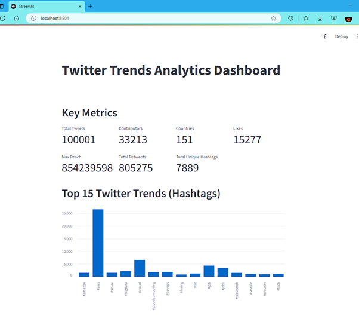
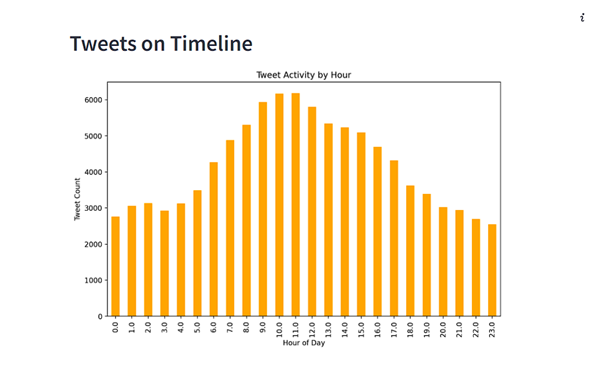
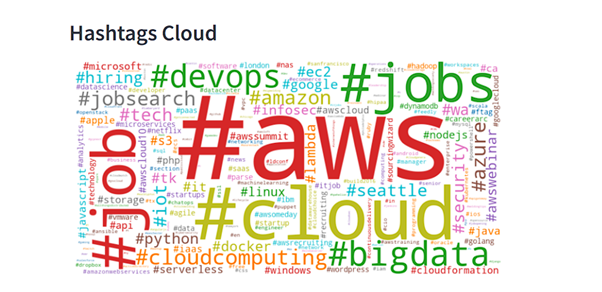
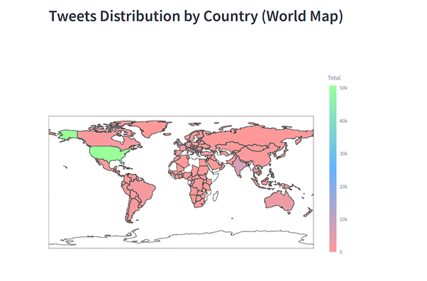
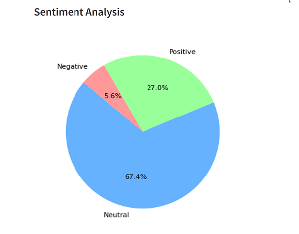
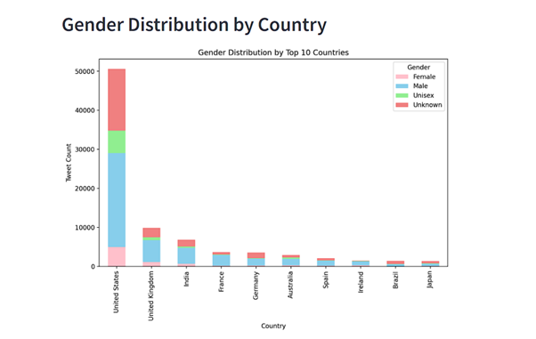
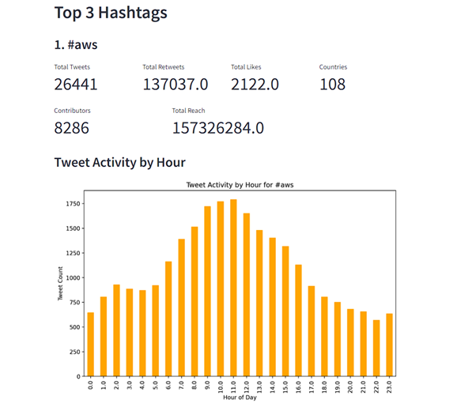
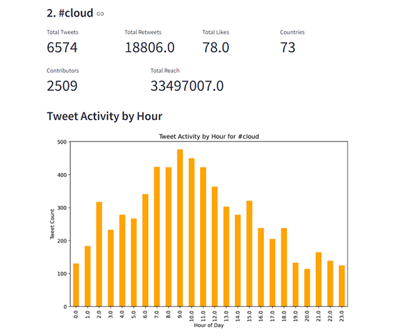
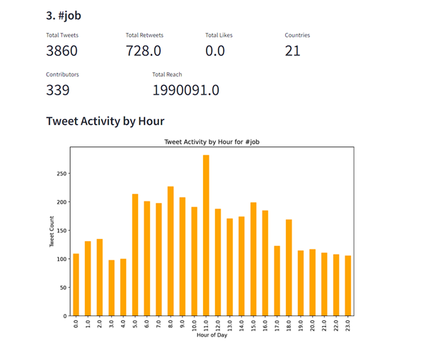

# Twitter Trend Analysis

### IIT Jodhpur | CSL7110 | Spring - 2025  

### Gaurav Ranjan (M24DE2006) | Mohd Zaigam Alishah (M24DE2016)  

##

## 1. Project Overview: 
This project focuses on analysing Twitter data to identify trending topics, hashtags, and user 
engagement patterns. The analysis focuses on understanding key engagement metrics, extracting top 
hashtags, performing sentiment analysis, visualizing temporal and geographical tweet distributions, 
and building a comprehensive dashboard to display the findings. 

## 2. Dataset Description 
The dataset used (tweetsdata.csv) consists of offline-collected tweets and includes the following key 
fields:  
- UserID, Gender, Country  
- Text (containing hashtags), Sentiment, Likes, RetweetCount, Reach 
- Timestamp, from which Hour is derived  

About Dataset:  
- File size: ~28 MB  
- Tweet Count: 100,000  
- Unique Users: 33,213  

## 3. Tools & Technologies  
- Language: Python  
- Libraries:  
  - Visualization: Matplotlib, Plotly, WordCloud  
  - Interface: Streamlit (for building interactive dashboard)  
  - Other: Pandas, collections, re, locale, etc  

## 4. Methodology 
### 4.1 Data Preprocessing  
- Cleaned column names to remove whitespace and handled missing tweet texts by filling 
them with empty strings. 
- Extracted hashtags from tweet texts using regular expressions. 
- Categorized sentiments as Positive, Negative, or Neutral based on sentiment score. 
### 4.2 Metrics Computed 
- Total Tweets: Count of all tweets in the dataset. 
- Unique Contributors: Number of unique users who tweeted. 
- Total Likes, Retweets, and Reach: Aggregated metrics for engagement. 
- Total and Unique Hashtags: Count of all hashtags and unique hashtags. 
- Number of Countries represented: Count of distinct countries from which tweets originated. 
### 4.3 Hashtag Analysis 
- Generated a bar chart of the top 15 most frequent hashtags. 
- Created a word cloud for visual representation of trending hashtags. 
### 4.4 Temporal Analysis 
- Plotted tweet distribution across hours of the day to observe peak activity times. 
### 4.5 Sentiment Analysis 
- Analysed sentiment distribution using a histogram with a KDE curve, for numerical sentiment 
scores. 
- Categorized tweets into three sentiment classes: Positive, negative and Neutral and  
- Visualized sentiment distribution using pie chart.
### 4.6 Geographical Distribution 
- Created a choropleth map using Plotly to show tweet count per country. 
- Analysed gender-wise tweet distribution in top 10 countries via a stacked bar chart. Each bar 
contains and represents the gender distribution for the specific country.  
### 4.7 Top Hashtags Deep-Dive 
For the top 3 hashtags, the following metrics were evaluated individually: 
- Total Tweets, Retweets, Likes, Reach 
- Number of contributing users and countries 
- Hour-wise tweet activity (visualized using bar charts) 
- Sentiment distribution pie chart (visualized using pie charts) 
- Country-wise Reach via a world map (visualized using world map)

## 5. Visual Dashboard 
An interactive dashboard was built using Streamlit to present the following insights: 
- Key engagement metrics: Displayed total tweets, contributors, likes, retweets, reach, and 
unique hashtags. 
- Hashtag trends: Visualized the top 15 hashtags using bar charts and word clouds. 
- Time-based tweet activity: Analysed tweet distribution across hours of the day to identify 
peak activity times. 
- Sentiment distribution: Showcased sentiment analysis using visualizations like histograms 
and pie charts. 
- Geographical and demographic insights: Presented tweet distribution by country using a 
choropleth map and gender-wise tweet distribution using stacked bar charts. 
- Drill-down view for the top 3 hashtags: Provided detailed metrics and visualizations for the 
top 3 hashtags, including tweet activity, sentiment distribution, and country-wise reach.

## 6. Key Findings 
- The most frequently used hashtags indicate trending topics across a diverse user base. 
  - #aws, #cloud & #job are the top 3 trending topics 
  - Majority of tweets were done by Male users, followed by users who have not 
disclosed their gender (unknown).  
- Tweet activity spikes during certain hours, indicating user behaviour patterns and 
engagement times. 
  - Major activities happening in between 6 AM to 4 PM and even in this period 10 AM 
11 AM is the peak time.  
- Neutral sentiment is predominant (67.4%), followed by positive (27.0%) and negative (5.6%). 
- Major contributions are from a few dominant countries, indicating regional trends.  
  - Total Countries: 150 
  - US, UK, India, France & Germany are the top 5 countries (in order of user and tweets 
volume) 
- Hashtags exhibit varying levels of reach and engagement depending on geography and time. 
  - Top 3 hashtags: #aws, #cloud, #job 
  - Majority of users talking about ‘aws’: 8286 users 
  - Most of the people talking about ‘job’ are active from early morning to mid-day (6 
AM – 3 PM), and peak at 11 AM. 
  - Majority of the users talking about ‘job’ are from North and South America, India, 
some parts of Europe (UK, France & Germany, etc), Japan, Philippines and Australia, 
etc.  
  - Almost entire world is talking about ‘cloud’, except Russia and African countries 
(except a few). 
  - Users from US leads almost all the topic discussions.

### Report Screenshots

## 7. Conclusion 
The project successfully demonstrates the power of data visualization and trend analysis in 
understanding social media dynamics. The dashboard provides actionable insights into user 
behaviour, sentiment trends, and geographical engagement. With further expansion, this analysis can 
be extended to: 
- Identify key influencers. 
- Measure the impact of marketing campaigns. 
- Detect breaking trends in real-time.

